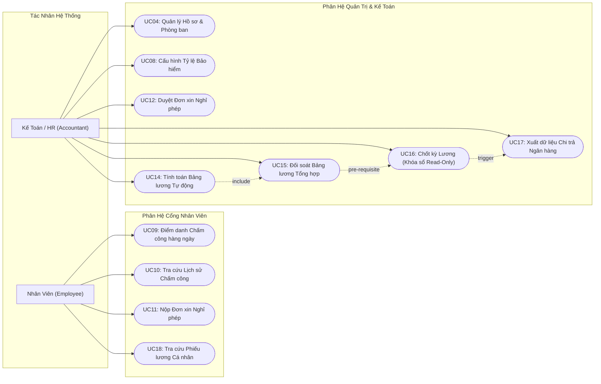
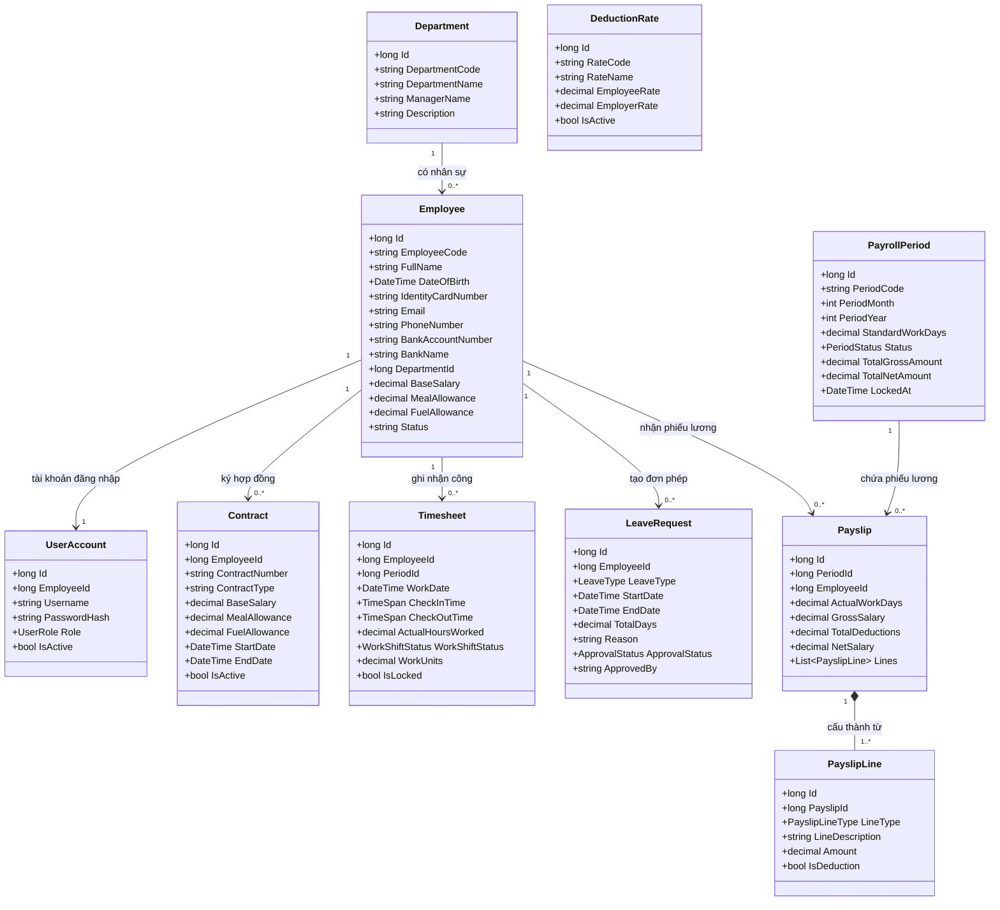
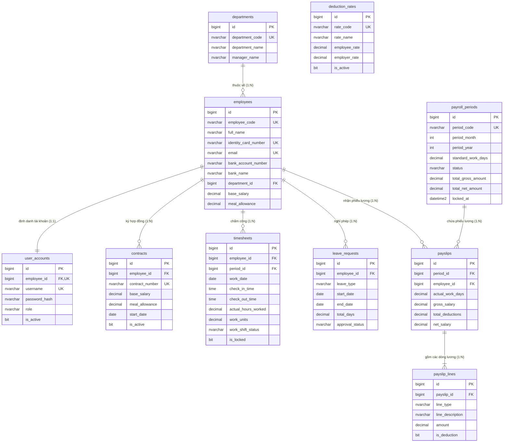
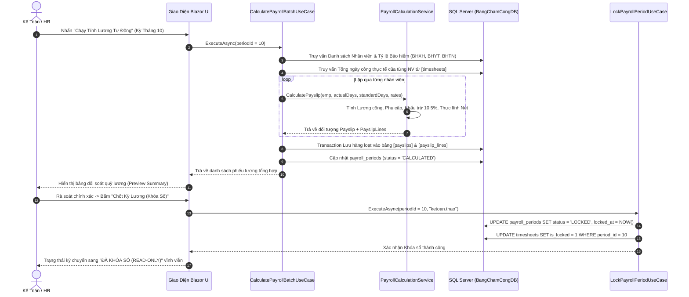
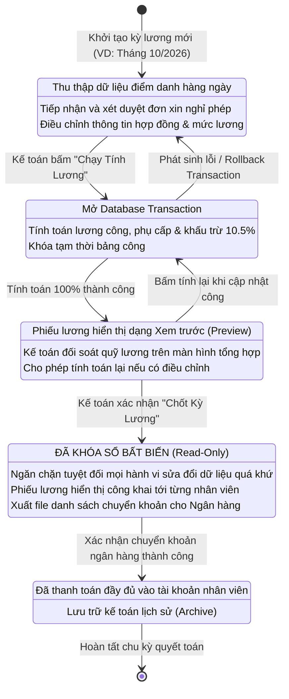

# ĐỒ ÁN MÔN HỌC: LẬP TRÌNH ỨNG DỤNG WEB
# HỆ THỐNG CHẤM CÔNG & TÍNH LƯƠNG TỰ ĐỘNG (TIMESHEET & PAYROLL SYSTEM)

---

## 📌 THÔNG TIN SINH VIÊN & HỌC PHẦN

* **Họ và tên sinh viên:** Trần Viết Mạnh Cường
* **Mã sinh viên (MSV):** `23K4080003`
* **Khoa:** Hệ thống Thông tin Kinh tế
* **Ngành học:** Tin học Kinh tế
* **Học phần:** Lập trình Ứng dụng Web
* **Tên đề tài:** **Hệ Thống Chấm Công & Tính Lương Tự Động (Timesheet & Payroll System)**
* **Kho lưu trữ (Repository):** [https://github.com/ManhCuong-Code/TimesheetPayroll](https://github.com/ManhCuong-Code/TimesheetPayroll)

---

## 📖 1. GIỚI THIỆU TỔNG QUAN & BỐI CẢNH DỰ ÁN

Tại các doanh nghiệp vừa và nhỏ (quy mô từ 20 đến 50 nhân sự), việc quản lý ngày công và tính lương thường phụ thuộc vào bảng tính Excel thủ công. Cách làm truyền thống này dẫn đến nhiều rủi ro:
1. **Sai lệch dữ liệu & nhầm lẫn công thức:** Kéo lệch dòng, công thức tính phụ cấp hoặc trích nộp bảo hiểm sai sót làm mất 2-3 ngày cuối tháng để đối soát.
2. **Thiếu tính minh bạch & lộ bảo mật thu nhập:** Bảng tính Excel chia sẻ chung dễ bị lộ thông tin thu nhập của nhân sự trong công ty.
3. **Thay đổi chính sách pháp lý:** Các mức trích nộp Bảo hiểm Xã hội (BHXH), Bảo hiểm Y tế (BHYT), Bảo hiểm Thất nghiệp (BHTN) thường bị hardcode cứng, khó cập nhật khi luật nhà nước thay đổi.

**Giải pháp đề tài:** Xây dựng **Hệ thống Chấm công & Tính lương tự động (Timesheet & Payroll System)** ứng dụng kiến trúc phân tầng sạch **Clean Architecture**, công nghệ **.NET 10 Blazor Interactive Server**, kết nối cơ sở dữ liệu **Microsoft SQL Server** thông qua **Dapper ORM**. Hệ thống tự động hóa toàn bộ quy trình: từ điểm danh hàng ngày, xét duyệt nghỉ phép trực tuyến, tính toán bảng lương hàng loạt 1-chạm an toàn, chốt sổ Read-Only chống sửa đổi, đến minh bạch phiếu lương chi tiết cho từng người lao động.

---

## 🎯 2. CÔNG NGHỆ ÁP DỤNG & KIẾN TRÚC HỆ THỐNG

| Thành phần | Công nghệ lựa chọn | Mục đích sử dụng |
| :--- | :--- | :--- |
| **Nền tảng phát triển** | **.NET 10 (C# 13)** | Nền tảng hiện đại, hiệu năng cao và bảo mật |
| **Giao diện Web** | **Blazor Interactive Server** | Render thời gian thực qua SignalR, trải nghiệm mượt mà không cần reload trang |
| **Giao diện & CSS** | **Bootstrap 5 + FontAwesome 6** | Chuẩn Responsive, phong cách trực quan, tối ưu trên Desktop và Mobile |
| **Kiến trúc phần mềm** | **Clean Architecture (Modular)** | Tách biệt hoàn toàn `CoreBusiness`, `UseCases`, `Plugins`, `Web.Modules` |
| **Hệ quản trị CSDL** | **Microsoft SQL Server (2019/2022/2025)** | CSDL quan hệ chuẩn hóa 3NF, CSDL riêng biệt `BangChamCongDB` |
| **Truy cập dữ liệu** | **Dapper Micro-ORM** | Thực thi câu lệnh SQL siêu tốc, ánh xạ đối tượng trực tiếp, kiểm soát tối đa câu truy vấn |

---

## 🧮 3. CÔNG THỨC NGHIỆP VỤ TÍNH LƯƠNG CHUẨN

Động cơ tính toán lương (`PayrollCalculationService`) áp dụng bộ công thức chuẩn hóa theo quy định hiện hành:

1. **Lương ngày công thực tế:**
   $$\text{Lương ngày công} = \text{Lương cơ bản} \times \frac{\text{Ngày công thực tế}}{\text{Ngày công chuẩn}}$$
2. **Thu nhập gộp (Gross Salary):**
   $$\text{Gross} = \text{Lương ngày công} + \text{Phụ cấp ăn trưa} + \text{Phụ cấp xăng xe}$$
3. **Các khoản trích nộp bảo hiểm bắt buộc theo luật (10.5% lương cơ bản):**
   * $\text{BHXH (Bảo hiểm Xã hội)} = \text{Lương cơ bản} \times 8.0\%$
   * $\text{BHYT (Bảo hiểm Y tế)} = \text{Lương cơ bản} \times 1.5\%$
   * $\text{BHTN (Bảo hiểm Thất nghiệp)} = \text{Lương cơ bản} \times 1.0\%$
   $$\text{Tổng khấu trừ} = \text{BHXH} + \text{BHYT} + \text{BHTN}$$
4. **Thu nhập thực nhận (Net Salary):**
   $$\text{Thực lĩnh (Net)} = \text{Gross} - \text{Tổng khấu trừ}$$

---

## 📊 4. MÔ HÌNH HÓA HỆ THỐNG BẰNG UML (UML DIAGRAMS)

### 4.1. Sơ Đồ Ca Sử Dụng (Use Case Diagram)



---

### 4.2. Sơ Đồ Lớp Miền Nghiệp Vụ (Domain Class Diagram)

Hệ thống được chuẩn hóa quanh **10 Thực thể nghiệp vụ cốt lõi**:



---

### 4.3. Sơ Đồ Thực Thể Liên Kết CSDL (Entity Relationship Diagram - ERD)

Toàn bộ CSDL được tổ chức trong cơ sở dữ liệu riêng biệt **`BangChamCongDB`** trên Microsoft SQL Server:



---

### 4.4. Sơ Đồ Tuần Tự (Sequence Diagram): Tính Lương Tự Động & Chốt Sổ An Toàn



---

### 4.5. Sơ Đồ Máy Trạng Thái (State Machine Diagram): Vòng Đời Kỳ Lương



---

## 🏗️ 5. CẤU TRÚC THƯ MỤC DỰ ÁN CLEAN ARCHITECTURE

```text
TimesheetPayroll/
│
├── TimesheetPayroll.slnx                                   # Visual Studio Solution
│
├── TimesheetPayroll.CoreBusiness/                          # Tầng Miền Nghiệp Vụ Cốt Lõi
│   ├── Models/
│   │   ├── Employee.cs                                     # Thực thể Nhân viên
│   │   ├── Department.cs                                   # Thực thể Phòng ban
│   │   ├── Timesheet.cs                                    # Thực thể Bảng chấm công
│   │   ├── PayrollPeriod.cs                                # Thực thể Kỳ lương
│   │   ├── Payslip.cs                                      # Thực thể Phiếu lương
│   │   ├── LeaveRequest.cs                                 # Thực thể Đơn nghỉ phép
│   │   ├── DeductionRate.cs                                # Thực thể Tỷ lệ bảo hiểm
│   │   └── Enums.cs                                        # Kiểu liệt kê (UserRole, WorkShiftStatus,...)
│   └── Services/
│       ├── Interfaces/IPayrollCalculationService.cs        # Interface động cơ tính lương
│       └── PayrollCalculationService.cs                    # Triển khai thuật toán tính toán lương
│
├── TimesheetPayroll.UseCases/                              # Tầng Trường Hợp Sử Dụng (Use Cases)
│   ├── AdminPortal/                                        # Ca sử dụng phân hệ Kế toán & Quản trị
│   │   └── AdminPortalUseCases.cs                          # Tính lương hàng loạt, Khóa sổ, Duyệt phép
│   ├── EmployeePortal/                                     # Ca sử dụng phân hệ Nhân viên
│   │   └── EmployeePortalUseCases.cs                       # Xem phiếu lương, Chấm công, Nộp đơn phép
│   └── PluginInterfaces/                                   # Hợp đồng giao tiếp tầng ngoài
│       └── DataStore/IRepositories.cs                      # Interface các Repository truy xuất CSDL
│
├── TimesheetPayroll.Web.Modules/                           # Các Module Giao Diện Blazor Độc Lập
│   ├── TimesheetPayroll.Web.AdminPortal/                   # Giao diện Cổng Quản trị / Kế toán
│   │   ├── Pages/PayrollBatchCalculationPage.razor         # Trang tính lương tự động & Chốt sổ
│   │   └── Controls/PayrollSummaryComponent.razor          # Bảng đối soát lương chi tiết
│   ├── TimesheetPayroll.Web.EmployeePortal/                # Giao diện Cổng Thông tin Nhân viên
│   │   ├── Pages/MyPayslipComponent.razor                  # Trang xem phiếu lương cá nhân
│   │   ├── Pages/MyTimesheetComponent.razor                # Trang điểm danh Check-In/Check-Out
│   │   ├── Pages/LeaveRequestComponent.razor               # Trang nộp đơn xin nghỉ phép
│   │   └── Controls/PayslipDetailCard.razor                # Thẻ đồ họa trực quan thu nhập cá nhân
│   └── TimesheetPayroll.Web.Common/                        # Thành phần tái sử dụng chung
│       └── Controls/SearchBarComponent.razor, StatusBadgeComponent.razor
│
├── Plugins/                                                # Tầng Hạ Tầng Kỹ Thuật (Infrastructure)
│   ├── TimesheetPayroll.DataStore.SQL.Dapper/              # Kết nối SQL Server qua Dapper Micro-ORM
│   │   ├── DataAccess.cs                                   # Quản lý SqlConnection
│   │   └── SqlRepositories.cs                              # Triển khai Dapper Repositories
│   ├── TimesheetPayroll.DataStore.HandCoded/               # Mock data chạy thử nghiệm độc lập
│   └── TimesheetPayroll.StateStore.DI/                     # Quản lý trạng thái phiên làm việc Blazor
│
└── TimesheetPayroll.Web/                                   # Ứng Dụng Host Blazor Web App
    ├── Components/
    │   ├── App.razor, Routes.razor
    │   ├── Layout/TopNavbar.razor, MainLayout.razor
    │   └── Pages/Home.razor                                # Trang chủ hệ thống
    ├── Program.cs                                          # Đăng ký Dependency Injection & Middleware
    └── appsettings.json                                    # Cấu hình Connection String CSDL
```

---

## 🚀 6. HƯỚNG DẪN CÀI ĐẶT & KHỞI CHẠY HỆ THỐNG

### Yêu cầu môi trường tiên quyết:
* **.NET SDK:** Phiên bản 10.0 (hoặc .NET 8.0/9.0 trở lên).
* **Hệ quản trị CSDL:** Microsoft SQL Server (SQLEXPRESS hoặc Developer) kèm SQL Server Management Studio (SSMS).
* **Trình duyệt Web:** Google Chrome, Microsoft Edge, Firefox.

---

### Bước 1: Khởi tạo Cơ sở dữ liệu SQL Server
1. Mở **SQL Server Management Studio (SSMS)** và kết nối tới máy chủ (ví dụ `.\SQLEXPRESS`).
2. Mở tệp script **`database_schema.sql`** (hoặc `database_mssql.sql`) nằm tại thư mục gốc dự án.
3. Nhấn **Execute (F5)** để tự động tạo CSDL riêng biệt **`BangChamCongDB`**, tạo đầy đủ 10 bảng dữ liệu và nạp sẵn bộ dữ liệu mẫu thực nghiệm.

---

### Bước 2: Cấu hình chuỗi kết nối (Connection String)
Kiểm tra tệp `project/TimesheetPayroll/TimesheetPayroll.Web/appsettings.json`:
```json
{
  "ConnectionStrings": {
    "DefaultConnection": "Server=.\\SQLEXPRESS;Database=BangChamCongDB;Trusted_Connection=True;TrustServerCertificate=True;"
  }
}
```

---

### Bước 3: Biên dịch và chạy ứng dụng Blazor
Mở PowerShell hoặc Command Prompt tại thư mục dự án và thực hiện:

```bash
# 1. Điều hướng vào thư mục mã nguồn
cd project/TimesheetPayroll

# 2. Khôi phục packages và kiểm tra biên dịch
dotnet build TimesheetPayroll.slnx

# 3. Khởi chạy ứng dụng Web Blazor
dotnet run --project TimesheetPayroll.Web
```

---

### Bước 4: Trải nghiệm các tính năng trên trình duyệt
Mở trình duyệt truy cập địa chỉ được hiển thị trong terminal (Mặc định: `https://localhost:5001` hoặc `http://localhost:5000`):

1. **Trang Chủ (`/`):** Dashboard tổng quan giới thiệu dự án và các nút điều hướng nhanh.
2. **Điểm Danh Chấm Công (`/my-timesheet`):**
   * Nhấn nút **Check-In (Vào ca)** và **Check-Out (Hết ca)** để hệ thống tự động ghi nhận thời gian và tính số giờ làm thực tế.
   * Xem bảng tổng hợp ngày công trong tháng của nhân viên.
3. **Nộp Đơn Nghỉ Phép (`/leave-request`):**
   * Chọn loại nghỉ phép (phép năm, nghỉ ốm, thai sản, không lương), chọn ngày bắt đầu, ngày kết thúc và nộp đơn.
4. **Xem Phiếu Lương Cá Nhân (`/my-payslip`):**
   * Hiển thị phiếu lương chi tiết của nhân viên Nguyễn Văn A (Mã `EMP001`): Lương công thực tế (20/22 ngày công), phụ cấp ăn trưa 500.000đ, khấu trừ bảo hiểm 10.5% (1.050.000đ), **Thực lĩnh chính xác 8.540.909 đ**.
5. **Kế Toán Tính Lương Hàng Loạt (`/admin/payroll-calculation`):**
   * Nhấn nút **"Chạy Tính Lương Tự Động"**: Hệ thống tự động tính toán đồng loạt cho toàn thể nhân sự.
   * Đối soát danh sách toàn bộ nhân viên, tổng quỹ lương gộp và thực lĩnh.
   * Nhấn nút **"Chốt Kỳ Lương (Khóa Sổ)"**: Khóa vĩnh viễn số liệu kỳ lương sang trạng thái **Read-Only** chống chỉnh sửa.

---

## 📋 7. KẾT LUẬN & ĐÁNH GIÁ ĐẠT ĐƯỢC

* ✅ **Đáp ứng 100% chuẩn học thuật:** Thiết kế hoàn chỉnh từ sơ đồ Ca sử dụng (Use Case), Lớp miền nghiệp vụ (Class), Tuần tự (Sequence), Hoạt động (Activity) đến Máy trạng thái (State Machine).
* ✅ **Mã nguồn chuẩn Clean Architecture:** Phân tầng độc lập, code rõ ràng, tuân thủ nguyên lý thiết kế SOLID.
* ✅ **Giao diện hiện đại:** Xây dựng bằng Blazor Server với phong cách trực quan, tối ưu trải nghiệm người dùng.
* ✅ **Toàn vẹn dữ liệu & Bảo mật:** Đảm bảo an toàn tài chính qua Database Transaction, cơ chế phân quyền và khóa sổ Read-Only bất biến.
