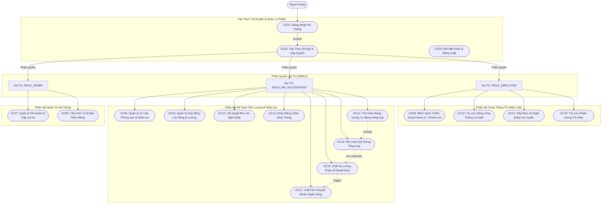
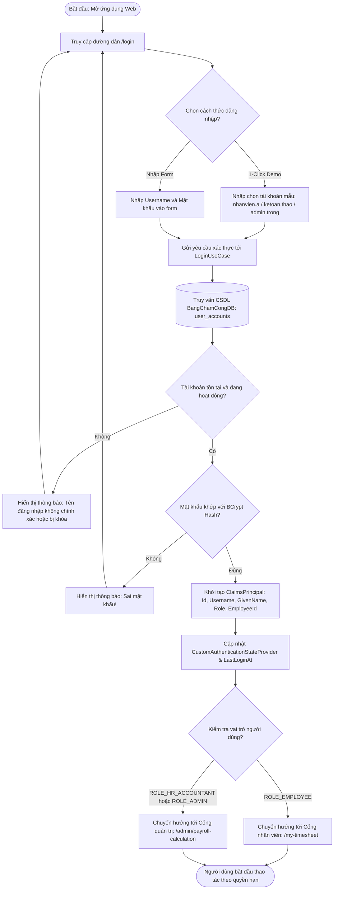
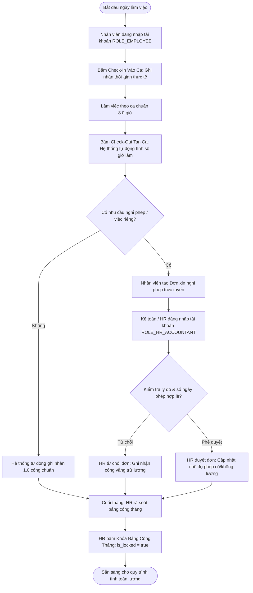
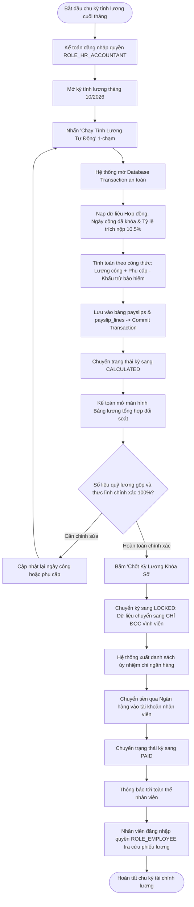
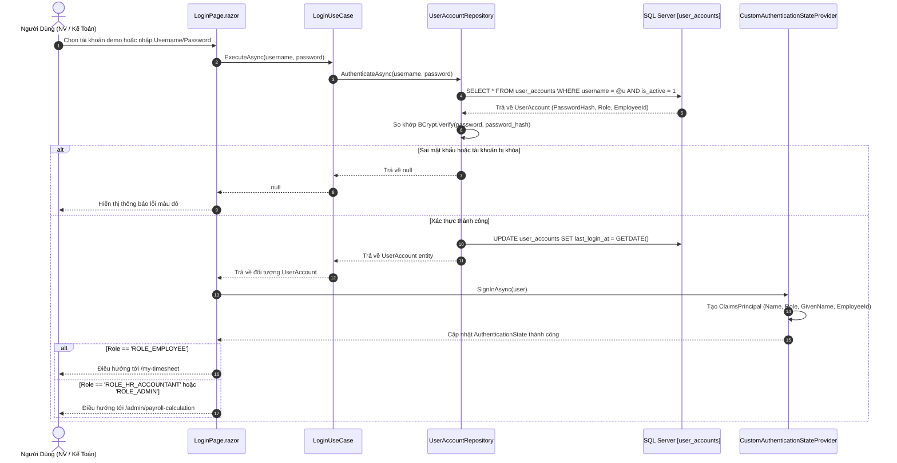
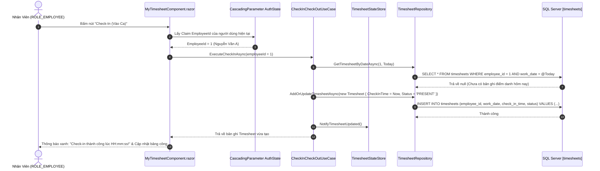
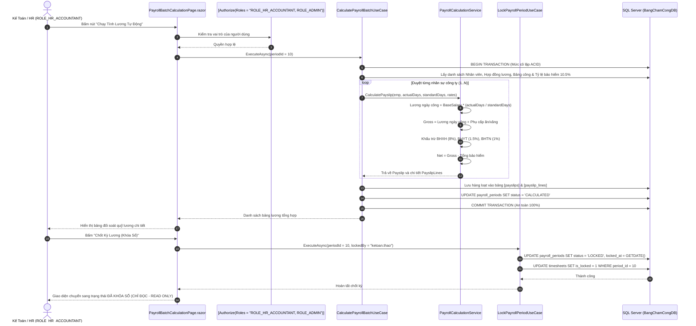
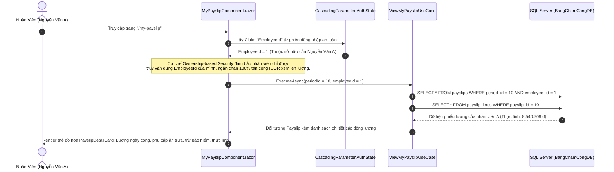
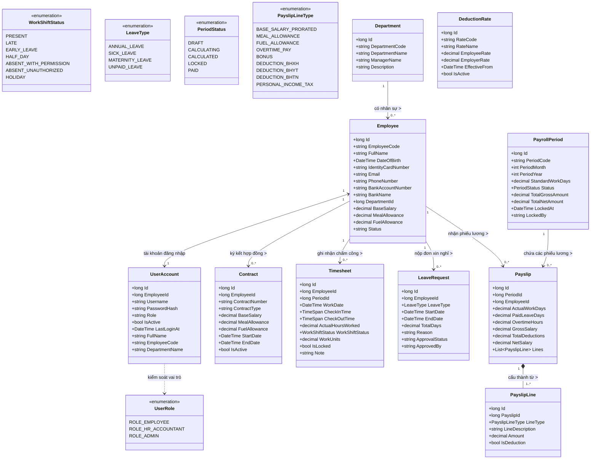
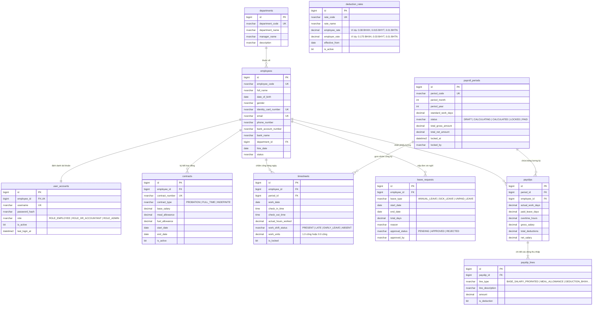

# ĐỒ ÁN MÔN HỌC: LẬP TRÌNH ỨNG DỤNG WEB
# HỆ THỐNG CHẤM CÔNG & TÍNH LƯƠNG TỰ ĐỘNG (TIMESHEET & PAYROLL SYSTEM)

---

## 📌 THÔNG TIN SINH VIÊN & HỌC PHẦN

* **Họ và tên sinh viên:** **Trần Viết Mạnh Cường**
* **Mã sinh viên (MSV):** `23K4080003`
* **Khoa:** **Hệ thống Thông tin Kinh tế**
* **Ngành học:** **Tin học Kinh tế**
* **Học phần:** **Lập trình Ứng dụng Web**
* **Tên đề tài:** **Hệ Thống Chấm Công & Tính Lương Tự Động (Timesheet & Payroll System)**
* **Kho lưu trữ (Repository):** [https://github.com/ManhCuong-Code/TimesheetPayroll.git](https://github.com/ManhCuong-Code/TimesheetPayroll.git)
* **Cơ sở dữ liệu:** **Microsoft SQL Server (`BangChamCongDB`)** *(Độc lập 100% với HomeStayHueDB)*
* **Nền tảng công nghệ:** **.NET 10 Blazor Interactive Server + Dapper Micro-ORM + Clean Architecture**

---

## 🔐 BẢNG TÀI KHOẢN ĐĂNG NHẬP THỬ NGHIỆM & PHÂN QUYỀN HỆ THỐNG (RBAC)

Hệ thống được thiết kế với cơ chế **Xác thực và Phân quyền dựa trên vai trò (Role-Based Access Control - RBAC)** kết hợp **Ownership-based Access Control** (kiểm soát quyền sở hữu dữ liệu cá nhân). Mọi thông tin tài khoản được lưu trữ và băm mật khẩu chuẩn **BCrypt** trong bảng `user_accounts` tại CSDL SQL Server `BangChamCongDB`.

Người dùng có thể đăng nhập tại đường dẫn: **`/login`** (hỗ trợ nút bấm **Đăng nhập nhanh 1-Click** hoặc nhập biểu mẫu kiểm tra trực tiếp vào SQL Server).

| STT | Tên Đăng Nhập | Mật Khẩu | Vai Trò (Role) | Họ Và Tên Nhân Viên | Mã NV | Phòng Ban | Quyền Hạn Nghiệp Vụ Trong Hệ Thống |
| :---: | :--- | :---: | :--- | :--- | :---: | :--- | :--- |
| **1** | `nhanvien.a` | `123456` | **`ROLE_EMPLOYEE`** | **Nguyễn Văn A** | `EMP001` | Phòng Công Nghệ Thông Tin | • Điểm danh Check-In/Check-Out hàng ngày<br/>• Tra cứu nhật ký chấm công tháng cá nhân<br/>• Tạo đơn xin nghỉ phép trực tuyến<br/>• Tra cứu phiếu lương chi tiết của chính mình (chống lộ IDOR) |
| **2** | `ketoan.thao` | `123456` | **`ROLE_HR_ACCOUNTANT`** | **Lê Thị Thu Thảo** | `EMP002` | Phòng Nhân Sự & Kế Toán | • Toàn bộ quyền của nhân viên<br/>• Xét duyệt/từ chối đơn xin nghỉ phép<br/>• Khóa bảng chấm công kỳ<br/>• **Chạy tính toán lương tự động hàng loạt 1-chạm**<br/>• Đối soát quỹ lương tổng hợp toàn công ty<br/>• **Chốt kỳ lương Khóa sổ (Read-Only)** chống sửa đổi<br/>• Xuất file chuyển khoản ngân hàng |
| **3** | `admin.trong` | `123456` | **`ROLE_ADMIN`** | **Trần Đình Trọng** | `EMP003` | Ban Giám Đốc / QTV | • Toàn quyền quản trị cao nhất toàn hệ thống<br/>• Quản lý tài khoản người dùng và cấp phát vai trò<br/>• Cấu hình các mức tỷ lệ trích nộp bảo hiểm (BHXH, BHYT, BHTN)<br/>• Giám sát tính lương và chốt sổ tài chính |
| **4** | `nhanvien.tuan` | `123456` | **`ROLE_EMPLOYEE`** | **Hoàng Minh Tuấn** | `EMP004` | Phòng Kinh Doanh & Tiếp Thị | • Chấm công, nộp đơn nghỉ phép và tra cứu phiếu thu nhập cá nhân độc lập của nhân viên Tuấn |

---

## 📖 1. GIỚI THIỆU TỔNG QUAN & BỐI CẢNH ĐỀ TÀI

Tại các doanh nghiệp vừa và nhỏ (quy mô 20 – 100 nhân sự), việc quản lý ngày công và tính lương thường phụ thuộc vào bảng tính Excel thủ công dẫn đến 3 vấn đề nhức nhối:
1. **Sai lệch công thức & rủi ro kéo lệch ô tính:** Mất từ 2 đến 3 ngày mỗi kỳ lương để kế toán đối soát thủ công ngày công, phụ cấp và các tỷ lệ bảo hiểm.
2. **Thiếu bảo mật & nguy cơ lộ thông tin thu nhập:** Chia sẻ file Excel nội bộ dễ khiến nhân viên xem được lương của nhau, vi phạm chính sách bảo mật doanh nghiệp.
3. **Luật lao động & tỷ lệ bảo hiểm thay đổi:** Các mức trích nộp Bảo hiểm Xã hội (BHXH 8%), Bảo hiểm Y tế (BHYT 1.5%), Bảo hiểm Thất nghiệp (BHTN 1%) thường bị hardcode cứng, khó tùy biến khi chính sách nhà nước điều chỉnh.

**Mục tiêu giải pháp:** Xây dựng **Hệ thống Chấm công & Tính lương tự động (Timesheet & Payroll System)** theo chuẩn kiến trúc sạch **Clean Architecture**, công nghệ **.NET 10 Blazor Interactive Server**, kết nối cơ sở dữ liệu **Microsoft SQL Server (`BangChamCongDB`)** qua **Dapper ORM**. Hệ thống tự động hóa toàn diện từ khâu điểm danh hàng ngày đến khâu quyết toán lương và bảo vệ dữ liệu tài chính bất biến bằng cơ chế khóa sổ kỳ lương (Read-Only Lock).

---

## 🧮 2. BỘ CÔNG THỨC NGHIỆP VỤ TÍNH LƯƠNG CHUẨN DOANH NGHIỆP

Động cơ tính toán lương (`PayrollCalculationService`) áp dụng bộ công thức chuẩn hóa theo quy định của Luật Lao động và Bảo hiểm:

1. **Lương ngày công thực tế theo tỷ lệ:**
   $$\text{Lương ngày công} = \text{Lương cơ bản} \times \frac{\text{Ngày công thực tế}}{\text{Ngày công chuẩn}}$$
2. **Tổng thu nhập gộp (Gross Salary):**
   $$\text{Gross} = \text{Lương ngày công} + \text{Phụ cấp ăn trưa} + \text{Phụ cấp xăng xe}$$
3. **Các khoản trích nộp bảo hiểm bắt buộc của người lao động (10.5% lương cơ bản):**
   * $\text{BHXH (Bảo hiểm Xã hội)} = \text{Lương cơ bản} \times 8.0\%$
   * $\text{BHYT (Bảo hiểm Y tế)} = \text{Lương cơ bản} \times 1.5\%$
   * $\text{BHTN (Bảo hiểm Thất nghiệp)} = \text{Lương cơ bản} \times 1.0\%$
   $$\text{Tổng khấu trừ bảo hiểm} = \text{BHXH} + \text{BHYT} + \text{BHTN} = \text{Lương cơ bản} \times 10.5\%$$
4. **Thu nhập thực lĩnh chuyển khoản (Net Salary):**
   $$\text{Thực lĩnh (Net)} = \text{Gross} - \text{Tổng khấu trừ bảo hiểm}$$

*Ví dụ thực tế với Nhân viên Nguyễn Văn A (Mã `EMP001`):*
* Lương cơ bản: **10.000.000 đ** | Phụ cấp ăn trưa: **500.000 đ** | Phụ cấp xăng: **0 đ**.
* Ngày công chuẩn: **22 ngày** | Ngày công thực tế đi làm: **20 ngày** (2 ngày nghỉ việc riêng có phép không lương).
* Lương ngày công: $10.000.000 \times \frac{20}{22} \approx \mathbf{9.090.909\text{ đ}}$.
* Thu nhập Gross: $9.090.909 + 500.000 = \mathbf{9.590.909\text{ đ}}$.
* Khấu trừ bảo hiểm 10.5%: $800.000\text{ (BHXH)} + 150.000\text{ (BHYT)} + 100.000\text{ (BHTN)} = \mathbf{1.050.000\text{ đ}}$.
* **Thực lĩnh Net:** $9.590.909 - 1.050.000 = \mathbf{8.540.909\text{ đ}}$ *(Khớp chính xác 100% trong CSDL và giao diện Web)*.

---

## 📊 3. TOÀN BỘ CÁC SƠ ĐỒ UML HỆ THỐNG KÈM THÔNG TIN ĐẶC TẢ CHI TIẾT

Hệ thống được mô hình hóa toàn diện bằng **13 sơ đồ UML chuẩn học thuật**, biểu diễn trực quan dạng **Mermaid Markdown** tương thích 100% trên GitHub. Dưới mỗi sơ đồ đều có đầy đủ thông tin: **Mục đích thiết kế, Các tác tử tham gia, Luồng xử lý dữ liệu và Quy tắc nghiệp vụ (Business Rules)**.

---

### SƠ ĐỒ 01: Ca Sử Dụng Tổng Quan Hệ Thống & Phân Quyền (System RBAC Overview Use Case Diagram)



#### 📋 Thông Tin Đặc Tả Sơ Đồ 01:
* **Mục đích:** Khái quát hóa toàn bộ ranh giới chức năng của hệ thống, thể hiện cấu trúc phân quyền dựa trên vai trò (Role-Based Access Control - RBAC) và mối liên kết logic giữa các ca sử dụng.
* **Các tác tử (Actors):**
  * `Người Dùng (User)`: Tác tử tổng quát thực hiện đăng nhập vào hệ thống.
  * `ROLE_EMPLOYEE (Nhân viên)`: Người lao động sử dụng cổng thông tin cá nhân.
  * `ROLE_HR_ACCOUNTANT (Kế toán tiền lương & Nhân sự)`: Chịu trách nhiệm duyệt phép, khóa công, chạy tính lương tự động và chốt sổ tài chính.
  * `ROLE_ADMIN (Quản trị viên)`: Quản trị tài khoản, phân quyền vai trò và cấu hình tham số hệ thống.
* **Mối quan hệ chính:**
  * `UC01 <<include>> UC02`: Quá trình đăng nhập bắt buộc phải đi kèm xác thực mật khẩu mã hóa BCrypt.
  * `UC14 <<include>> UC15`: Tính toán bảng lương tự động hàng loạt luôn đi kèm bước xuất bảng đối soát tổng hợp.
  * `UC15 ..> UC16 ..> UC17`: Chuỗi quy trình bắt buộc: Đối soát quỹ lương $\rightarrow$ Chốt kỳ khóa sổ $\rightarrow$ Xuất file chi trả ngân hàng.

---

### SƠ ĐỒ 02: Ca Sử Dụng Chi Tiết - Phân Hệ Nhân Viên (Employee Portal Use Case Diagram)

```mermaid
flowchart LR
    actor Emp as "Nhân Viên (ROLE_EMPLOYEE)"

    subgraph ScopeEmp["Cổng Nhân Viên (Yêu cầu Xác thực & Quyền Sở hữu)"]
        Auth(["Xác Thực Tài Khoản Đăng Nhập"])
        CI(["UC09a: Điểm Danh Vào Ca (Check-In)"])
        CO(["UC09b: Điểm Danh Tan Ca (Check-Out)"])
        VT(["UC10: Tra Cứu Nhật Ký Chấm Công Hàng Ngày"])
        LR(["UC11: Tạo Đơn Xin Nghỉ Phép Trực Tuyến"])
        VP(["UC18: Tra Cứu Phiếu Lương Cá Nhân Minh Bạch"])
        DT(["UC19: Xem Giải Thích Chi Tiết Thu Nhập & Bảo Hiểm"])
    end

    Emp --> Auth
    Auth --> CI
    Auth --> CO
    Auth --> VT
    Auth --> LR
    Auth --> VP
    VP -.->|extend| DT
```

#### 📋 Thông Tin Đặc Tả Sơ Đồ 02:
* **Mục đích:** Mô hình hóa các chức năng tự phục vụ (Self-Service) dành riêng cho người lao động, đề cao tính tiện lợi và bảo mật quyền sở hữu dữ liệu cá nhân.
* **Tác tử:** `ROLE_EMPLOYEE` (Người lao động).
* **Quy tắc nghiệp vụ then chốt:**
  * **Chấm công 1 lần/ngày:** Nhân viên chỉ được điểm danh Check-In/Check-Out trong ngày làm việc hiện tại, hệ thống tự động ghi nhận giờ server ngăn chặn gian lận thời gian.
  * **Anti-IDOR:** Nhân viên chỉ có quyền truy vấn phiếu lương (`UC18`) gắn liền với `EmployeeId` của chính mình được trích xuất từ phiên đăng nhập an toàn (`ClaimsPrincipal`), tuyệt đối không được xem lương của đồng nghiệp.

---

### SƠ ĐỒ 03: Ca Sử Dụng Chi Tiết - Phân Hệ Kế Toán & Quản Trị (HR & Admin Payroll Use Case Diagram)

```mermaid
flowchart LR
    actor HR as "Kế Toán / HR (ROLE_HR_ACCOUNTANT)"
    actor Admin as "Quản Trị Viên (ROLE_ADMIN)"

    subgraph ScopeAdmin["Phân Hệ Quản Trị & Kế Toán Tiền Lương"]
        UC_Emp(["UC04: Quản Lý Hồ Sơ & Phòng Ban"])
        UC_Leave(["UC12: Duyệt / Từ Chối Đơn Nghỉ Phép"])
        UC_LockTS(["UC13: Khóa Bảng Chấm Công Tháng"])
        UC_Batch(["UC14: Chạy Tính Lương Tự Động Toàn Doanh Nghiệp"])
        UC_Preview(["UC15: Đối Soát Bảng Lương Tổng Hợp"])
        UC_LockPR(["UC16: Chốt Kỳ Lương Khóa Sổ (Read-Only)"])
        UC_Bank(["UC17: Xuất File Ủy Nhiệm Chi Ngân Hàng"])
        UC_User(["UC07: Quản Lý Người Dùng & Phân Quyền"])
        UC_Rate(["UC08: Cấu Hình Tỷ Lệ Bảo Hiểm Động"])
    end

    HR --> UC_Emp
    HR --> UC_Leave
    HR --> UC_LockTS
    HR --> UC_Batch
    HR --> UC_Preview
    HR --> UC_LockPR
    HR --> UC_Bank

    Admin --> UC_User
    Admin --> UC_Rate
    Admin --> UC_LockPR

    UC_Batch -->|Bắt buộc| UC_Preview
    UC_Preview -->|Điều kiện tiên quyết| UC_LockPR
    UC_LockPR -->|Kích hoạt| UC_Bank
```

#### 📋 Thông Tin Đặc Tả Sơ Đồ 03:
* **Mục đích:** Mô tả quy trình vận hành quản trị nhân sự, xử lý nghiệp vụ tiền lương định kỳ và quản lý chính sách doanh nghiệp.
* **Tác tử:** `ROLE_HR_ACCOUNTANT` (Kế toán), `ROLE_ADMIN` (Quản trị viên).
* **Quy tắc nghiệp vụ:**
  * Kế toán phải xét duyệt xong đơn nghỉ phép (`UC12`) và khóa bảng công (`UC13`) trước khi chạy tính lương (`UC14`).
  * Tính lương hàng loạt bắt buộc phải qua đối soát (`UC15`) trước khi có thể bấm nút chốt sổ kỳ lương (`UC16`).

---

### SƠ ĐỒ 04: Sơ Đồ Hoạt Động - Quy Trình Xác Thực Đăng Nhập & Phân Quyền (Login & RBAC Activity Diagram)



#### 📋 Thông Tin Đặc Tả Sơ Đồ 04:
* **Mục đích:** Chi tiết hóa quy trình xác thực người dùng từ giao diện Web, xử lý nghiệp vụ so khớp mật khẩu mã hóa và định tuyến động theo quyền hạn.
* **Các điểm quyết định (Decision Points):**
  * `UserExist`: Kiểm tra tài khoản có tồn tại trong bảng `user_accounts` và trường `is_active = 1`.
  * `VerifyPass`: Kiểm tra mật khẩu bằng giải thuật `BCrypt.Verify(password, password_hash)`.
  * `RouteRole`: Phân luồng điều hướng: Nhân viên vào `/my-timesheet`, Kế toán/Admin vào `/admin/payroll-calculation`.

---

### SƠ ĐỒ 05: Sơ Đồ Hoạt Động - Quy Trình Điểm Danh Chấm Công & Nghỉ Phép (Timesheet & Leave Activity Diagram)



#### 📋 Thông Tin Đặc Tả Sơ Đồ 05:
* **Mục đích:** Minh họa quy trình điểm danh hàng ngày của nhân viên và quy trình xét duyệt đơn xin nghỉ phép của bộ phận nhân sự.
* **Quy tắc tính công:**
  * Đi làm đủ ca $\geq 8$ giờ: Hệ thống ghi nhận $1.0$ ngày công (`work_units = 1.0`).
  * Nghỉ phép có hưởng lương (Nghỉ phép năm): Được cộng vào số ngày tính lương cơ bản.
  * Nghỉ việc riêng không hưởng lương: Bị trừ ngày công tương ứng theo công thức tính lương tỷ lệ.

---

### SƠ ĐỒ 06: Sơ Đồ Hoạt Động - Quy Trình Tự Động Hóa Tính Lương & Quyết Toán (Payroll Settlement Activity Diagram)



#### 📋 Thông Tin Đặc Tả Sơ Đồ 06:
* **Mục đích:** Đặc tả chu kỳ quyết toán lương cuối tháng với các trạm kiểm soát dữ liệu nghiêm ngặt.
* **Tính toàn vẹn dữ liệu (ACID Transaction):** Toàn bộ phép tính lương hàng loạt cho 100% nhân viên chạy trong một Database Transaction. Nếu có bất kỳ lỗi nào xảy ra (thiếu hợp đồng, lỗi chia 0), hệ thống tự động `ROLLBACK` an toàn, ngăn chặn việc tính dở dang gây sai lệch số sách kế toán.

---

### SƠ ĐỒ 07: Sơ Đồ Tuần Tự - Xác Thực Đăng Nhập & Cấp Phiên (Authentication & Session Sequence Diagram)



#### 📋 Thông Tin Đặc Tả Sơ Đồ 07:
* **Mục đích:** Minh họa trình tự trao đổi thông điệp thời gian thực giữa các lớp khi người dùng đăng nhập hệ thống.
* **Bảo mật:** Mật khẩu thô không bao giờ được lưu trữ. Hàm `AuthenticateAsync` thực hiện so khớp hàm băm một chiều BCrypt an toàn.

---

### SƠ ĐỒ 08: Sơ Đồ Tuần Tự - Điểm Danh Chấm Công Check-In / Check-Out Trực Tuyến (Daily Attendance Sequence Diagram)



#### 📋 Thông Tin Đặc Tả Sơ Đồ 08:
* **Mục đích:** Thể hiện luồng gọi hàm từ Blazor Component qua Use Case đến tầng Repository khi nhân viên điểm danh trực tuyến.
* **Cơ chế Reactive:** Sử dụng `TimesheetStateStore` phát sự kiện cập nhật giao diện ngay lập tức mà không cần F5 tải lại trang.

---

### SƠ ĐỒ 09: Sơ Đồ Tuần Tự - Kế Toán Tính Lương Hàng Loạt & Khóa Sổ Read-Only (Payroll Batch & Lock Sequence Diagram)



#### 📋 Thông Tin Đặc Tả Sơ Đồ 09:
* **Mục đích:** Minh họa quy trình xử lý tính lương hàng loạt cho nhiều nhân sự và kỹ thuật khóa sổ bảo vệ dữ liệu tài chính.
* **Điểm nhấn thiết kế:**
  * Tách rời tầng tính toán logic (`PayrollCalculationService`) khỏi tầng lưu trữ CSDL.
  * Lệnh khóa sổ đóng băng cả bảng `payroll_periods` và `timesheets`, ngăn chặn triệt để mọi hành vi chỉnh sửa lén lút dữ liệu quá khứ.

---

### SƠ ĐỒ 10: Sơ Đồ Tuần Tự - Tra Cứu Phiếu Lương Cá Nhân Bảo Mật Chống Lộ IDOR (My Payslip Ownership Security Sequence Diagram)



#### 📋 Thông Tin Đặc Tả Sơ Đồ 10:
* **Mục đích:** Minh họa cơ chế bảo mật phiếu lương cá nhân.
* **Nguyên lý Anti-IDOR:** Ứng dụng không cho phép truyền `employeeId` qua URL query string một cách tùy tiện mà tự động trích xuất mã nhân viên từ phiên Claims đã được ký số an toàn trên server.

---

### SƠ ĐỒ 11: Sơ Đồ Lớp Miền Nghiệp Vụ & Phân Quyền (Domain Entities & Security Class Diagram)



#### 📋 Thông Tin Đặc Tả Sơ Đồ 11:
* **Mục đích:** Định nghĩa cấu trúc các lớp thực thể nghiệp vụ cốt lõi (Domain Entities), các kiểu liệt kê (Enums), mối quan hệ kết tập, hợp thành và lực lượng (Cardinality).
* **Đặc điểm mô hình:**
  * `Employee 1 <--> 1 UserAccount`: Quan hệ 1-1 chặt chẽ giữa hồ sơ nhân viên và tài khoản đăng nhập hệ thống.
  * `Payslip 1 *-- 1..* PayslipLine`: Quan hệ hợp thành (Composition) – một phiếu lương bao gồm nhiều dòng chi tiết giải trình các khoản thu nhập và giảm trừ bảo hiểm.

---

### SƠ ĐỒ 12: Sơ Đồ Kiến Trúc Thành Phần Hệ Thống Clean Architecture (System Component Diagram)

```mermaid
flowchart TB
    subgraph PresentationTier["1. Tầng Trình Diễn (Presentation - Blazor Interactive Server)"]
        Host["TimesheetPayroll.Web<br/>(Host App, SignalR WebSocket, Program.cs)"]
        AuthComp["CustomAuthenticationStateProvider<br/>(Quản lý phiên đăng nhập, Claims & RBAC)"]
        ModAdmin["TimesheetPayroll.Web.AdminPortal<br/>(PayrollBatchCalculationPage, SummaryControls)"]
        ModEmp["TimesheetPayroll.Web.EmployeePortal<br/>(MyTimesheet, MyPayslip, LeaveRequest)"]
        ModCommon["TimesheetPayroll.Web.Common<br/>(SearchBar, StatusBadge, Controls)"]
    end

    subgraph UseCasesTier["2. Tầng Trường Hợp Sử Dụng (Use Cases)"]
        UCAdmin["AdminPortal Use Cases<br/>(CalculatePayrollBatch, LockPeriod, ProcessLeave)"]
        UCEmp["EmployeePortal Use Cases<br/>(ViewMyPayslip, CheckInCheckOut, ViewTimesheet)"]
        UCAuth["Authentication Use Cases<br/>(LoginUseCase, GetUserAccountsUseCase)"]
        PluginIntf["PluginInterfaces.DataStore<br/>(IRepositories: User, Employee, Timesheet, Payslip)"]
    end

    subgraph CoreBusinessTier["3. Tầng Miền Nghiệp Vụ Cốt Lõi (Core Business)"]
        DomainModels["Domain Entities<br/>(Employee, UserAccount, Timesheet, Payslip, PayrollPeriod)"]
        CalcEngine["PayrollCalculationService<br/>(IPayrollCalculationService: Động cơ tính lương chuẩn)"]
    end

    subgraph InfrastructureTier["4. Tầng Hạ Tầng Kỹ Thuật & CSDL (Infrastructure Plugins)"]
        DapperRepo["TimesheetPayroll.DataStore.SQL.Dapper<br/>(UserAccountRepository, PayslipRepo, TimesheetRepo)"]
        StateStore["TimesheetPayroll.StateStore.DI<br/>(TimesheetStateStore)"]
        HandCoded["TimesheetPayroll.DataStore.HandCoded<br/>(Mock Data Testing)"]
        SQLDB[("Microsoft SQL Server Instance<br/>Database: BangChamCongDB (10 Bảng)")]
    end

    Host --> AuthComp
    Host --> ModAdmin
    Host --> ModEmp
    Host --> ModCommon

    ModAdmin --> UCAdmin
    ModEmp --> UCEmp
    AuthComp --> UCAuth
    ModCommon --> DomainModels

    UCAdmin --> PluginIntf
    UCAdmin --> CalcEngine
    UCEmp --> PluginIntf
    UCAuth --> PluginIntf

    PluginIntf --> DomainModels
    CalcEngine --> DomainModels

    DapperRepo ..|> PluginIntf
    HandCoded ..|> PluginIntf
    StateStore --> DomainModels
    DapperRepo --> SQLDB
```

#### 📋 Thông Tin Đặc Tả Sơ Đồ 12:
* **Mục đích:** Thể hiện kiến trúc phần mềm phân tầng sạch (Clean Architecture), đảm bảo nguyên lý đảo ngược phụ thuộc (Dependency Inversion Principle - DIP).
* **Quy tắc phụ thuộc:**
  * Tầng `CoreBusiness` nằm ở trung tâm và không phụ thuộc vào bất kỳ framework bên ngoài nào.
  * Tầng `UseCases` chỉ giao tiếp với tầng CSDL thông qua các abstraction interface (`PluginInterfaces`).
  * Tầng `Infrastructure` (Dapper) và `Presentation` (Blazor) phụ thuộc hướng vào trong, cho phép dễ dàng thay đổi CSDL hoặc nâng cấp UI mà không ảnh hưởng logic lõi.

---

### SƠ ĐỒ 13: Sơ Đồ Quan Hệ Thực Thể CSDL 10 Bảng Chuẩn Hóa (Entity Relationship Diagram - ERD)



#### 📋 Bảng Từ Điển Dữ Liệu 10 Bảng Nghiệp Vụ CSDL `BangChamCongDB`:

| STT | Tên Bảng SQL | Mục Đích Lưu Trữ | Khóa Chính (PK) | Khóa Ngoại (FK) & Quan Hệ | Ràng Buộc Nghiệp Vụ (Constraints) |
| :---: | :--- | :--- | :---: | :--- | :--- |
| **1** | `departments` | Cơ cấu phòng ban công ty | `id` (BIGINT) | Không | `department_code` UNIQUE |
| **2** | `employees` | Hồ sơ nhân sự, CCCD, tài khoản nhận lương | `id` (BIGINT) | `department_id` $\rightarrow$ `departments(id)` | `employee_code`, `identity_card_number`, `email` UNIQUE |
| **3** | `user_accounts` | Tài khoản đăng nhập & phân quyền | `id` (BIGINT) | `employee_id` $\rightarrow$ `employees(id)` (1-1) | `username` UNIQUE, `role` CHECK (EMPLOYEE, HR, ADMIN) |
| **4** | `contracts` | Hợp đồng lao động, mức lương CB, phụ cấp | `id` (BIGINT) | `employee_id` $\rightarrow$ `employees(id)` | `contract_number` UNIQUE, `base_salary >= 0` |
| **5** | `payroll_periods` | Kỳ lương hàng tháng, trạng thái khóa sổ | `id` (BIGINT) | Không | `(period_month, period_year)` UNIQUE |
| **6** | `deduction_rates` | Danh mục tỷ lệ bảo hiểm (BHXH, BHYT, BHTN) | `id` (BIGINT) | Không | `rate_code` UNIQUE, `employee_rate >= 0` |
| **7** | `timesheets` | Nhật ký chấm công hàng ngày | `id` (BIGINT) | `employee_id` $\rightarrow$ `employees(id)`, `period_id` $\rightarrow$ `payroll_periods(id)` | `(employee_id, work_date)` UNIQUE |
| **8** | `leave_requests` | Đơn xin nghỉ phép trực tuyến | `id` (BIGINT) | `employee_id` $\rightarrow$ `employees(id)` | `approval_status` IN ('PENDING', 'APPROVED', 'REJECTED') |
| **9** | `payslips` | Phiếu lương tổng hợp của từng nhân sự | `id` (BIGINT) | `period_id` $\rightarrow$ `payroll_periods(id)`, `employee_id` $\rightarrow$ `employees(id)` | `(period_id, employee_id)` UNIQUE |
| **10** | `payslip_lines` | Chi tiết các dòng lương, phụ cấp & khấu trừ | `id` (BIGINT) | `payslip_id` $\rightarrow$ `payslips(id)` (Cascade Delete) | `amount >= 0`, `is_deduction` BIT |

---

## 📑 4. MA TRẬN TRUY VẾT YÊU CẦU NGHIỆP VỤ (TRACEABILITY MATRIX)

Ma trận truy vết đảm bảo tính đồng bộ $100\%$ giữa các yêu cầu nghiệp vụ doanh nghiệp (Business Requirements), các mã Use Case, các lớp đối tượng Domain Model và các bảng CSDL:

| Mã Yêu Cầu | Tên Nghiệp Vụ Doanh Nghiệp | Mã Use Case | Lớp Đối Tượng (C# Model) | Bảng SQL Server |
| :---: | :--- | :---: | :--- | :--- |
| **BR-01** | Quản lý cơ cấu phòng ban công ty | `UC04` | `Department` | `departments` |
| **BR-02** | Quản lý tài khoản, xác thực mật khẩu BCrypt & phân quyền RBAC | `UC01, UC02, UC03` | `UserAccount` | `user_accounts` |
| **BR-03** | Quản lý hồ sơ lý lịch nhân sự & tài khoản ngân hàng nhận lương | `UC05` | `Employee` | `employees` |
| **BR-04** | Quản lý hợp đồng lao động, mức lương cơ bản & phụ cấp cố định | `UC06` | `Contract` | `contracts` |
| **BR-05** | Cấu hình tỷ lệ trích nộp bảo hiểm bắt buộc theo luật định | `UC08` | `DeductionRate` | `deduction_rates` |
| **BR-06** | Điểm danh chấm công trực tuyến & theo dõi nhật ký hàng ngày | `UC09, UC10` | `Timesheet` | `timesheets` |
| **BR-07** | Tạo đơn và xét duyệt đơn xin nghỉ phép trực tuyến | `UC11, UC12` | `LeaveRequest` | `leave_requests` |
| **BR-08** | Khởi tạo kỳ lương, chạy tính toán bảng lương tự động hàng loạt 1-chạm | `UC13, UC14` | `PayrollPeriod, Payslip` | `payroll_periods, payslips` |
| **BR-09** | Đối soát quỹ lương tổng hợp, chốt sổ Read-Only & xuất file ngân hàng | `UC15, UC16, UC17` | `PayrollPeriod, Payslip` | `payroll_periods, payslips` |
| **BR-10** | Bảo mật phiếu lương cá nhân chống xem lén thu nhập (Anti-IDOR) | `UC18` | `Payslip, PayslipLine` | `payslips, payslip_lines` |

---

## 🏗️ 5. CẤU TRÚC THƯ MỤC MÃ NGUỒN CLEAN ARCHITECTURE

```text
TimesheetPayroll/
│
├── TimesheetPayroll.slnx                                   # Visual Studio Solution File
│
├── TimesheetPayroll.CoreBusiness/                          # TẦNG MIỀN NGHIỆP VỤ CỐT LÕI (CORE BUSINESS)
│   ├── Models/
│   │   ├── Employee.cs                                     # Thực thể Nhân viên
│   │   ├── Department.cs                                   # Thực thể Phòng ban
│   │   ├── UserAccount.cs                                  # Thực thể Tài khoản người dùng & Phân quyền
│   │   ├── Timesheet.cs                                    # Thực thể Bảng chấm công
│   │   ├── PayrollPeriod.cs                                # Thực thể Kỳ lương
│   │   ├── Payslip.cs                                      # Thực thể Phiếu lương & Dòng chi tiết
│   │   ├── LeaveRequest.cs                                 # Thực thể Đơn nghỉ phép
│   │   ├── DeductionRate.cs                                # Thực thể Tỷ lệ bảo hiểm
│   │   └── Enums.cs                                        # Kiểu liệt kê (UserRole, WorkShiftStatus,...)
│   └── Services/
│       ├── Interfaces/IPayrollCalculationService.cs        # Interface động cơ tính toán lương
│       └── PayrollCalculationService.cs                    # Triển khai thuật toán tính lương luật định
│
├── TimesheetPayroll.UseCases/                              # TẦNG TRƯỜNG HỢP SỬ DỤNG (USE CASES)
│   ├── Authentication/                                     # Ca sử dụng xác thực người dùng
│   │   └── LoginUseCase.cs                                 # Đăng nhập, kiểm tra mật khẩu BCrypt, lấy DS User
│   ├── AdminPortal/                                        # Ca sử dụng phân hệ Kế toán & Quản trị
│   │   └── AdminPortalUseCases.cs                          # Tính lương hàng loạt, Khóa sổ, Duyệt phép
│   ├── EmployeePortal/                                     # Ca sử dụng phân hệ Nhân viên
│   │   └── EmployeePortalUseCases.cs                       # Xem phiếu lương, Điểm danh công, Nộp đơn phép
│   └── PluginInterfaces/                                   # Hợp đồng giao tiếp tầng ngoài (Repository Interfaces)
│       └── DataStore/IRepositories.cs                      # IUserAccountRepository, IEmployeeRepository,...
│
├── TimesheetPayroll.Web.Modules/                           # CÁC MODULE GIAO DIỆN BLAZOR ĐỘC LẬP
│   ├── TimesheetPayroll.Web.AdminPortal/                   # Cổng Kế toán & Quản trị Lương
│   │   ├── Pages/PayrollBatchCalculationPage.razor         # Trang tính lương tự động & Chốt sổ Read-Only
│   │   └── Controls/PayrollSummaryComponent.razor          # Bảng đối soát lương chi tiết
│   ├── TimesheetPayroll.Web.EmployeePortal/                # Cổng Thông tin Nhân viên Cá nhân
│   │   ├── Pages/MyPayslipComponent.razor                  # Trang xem phiếu lương cá nhân (Anti-IDOR)
│   │   ├── Pages/MyTimesheetComponent.razor                # Trang điểm danh Check-In/Check-Out
│   │   ├── Pages/LeaveRequestComponent.razor               # Trang nộp đơn xin nghỉ phép trực tuyến
│   │   └── Controls/PayslipDetailCard.razor                # Thẻ đồ họa trực quan thu nhập & bảo hiểm
│   └── TimesheetPayroll.Web.Common/                        # Thành phần tái sử dụng chung
│       └── Controls/SearchBarComponent.razor, StatusBadgeComponent.razor
│
├── Plugins/                                                # TẦNG HẠ TẦNG KỸ THUẬT & TRUY XUẤT CSDL
│   ├── TimesheetPayroll.DataStore.SQL.Dapper/              # Kết nối SQL Server qua Dapper Micro-ORM
│   │   ├── DataAccess.cs                                   # Quản lý kết nối SqlConnection
│   │   └── SqlRepositories.cs                              # Triển khai các Repositories với Dapper & BCrypt
│   ├── TimesheetPayroll.DataStore.HandCoded/               # Dữ liệu giả lập chạy thử nghiệm offline
│   └── TimesheetPayroll.StateStore.DI/                     # Quản lý trạng thái SignalR StateStore
│
└── TimesheetPayroll.Web/                                   # ỨNG DỤNG HOST BLAZOR WEB APP (.NET 10)
    ├── Components/
    │   ├── App.razor, Routes.razor                         # Cấu hình AuthorizeRouteView bảo vệ phân quyền
    │   ├── Layout/TopNavbar.razor, MainLayout.razor        # Thanh điều hướng phân quyền & Đăng xuất
    │   └── Pages/
    │       ├── Home.razor                                  # Trang chủ giới thiệu hệ thống & đồ án
    │       └── LoginPage.razor                             # Trang đăng nhập hỗ trợ 1-Click Demo & Form SQL
    ├── CustomAuthenticationStateProvider.cs                # Triển khai AuthenticationStateProvider Blazor
    ├── Program.cs                                          # Đăng ký Dependency Injection & Middleware
    └── appsettings.json                                    # Cấu hình kết nối tới BangChamCongDB
```

---

## 🚀 6. HƯỚNG DẪN CÀI ĐẶT & KHỞI CHẠY HỆ THỐNG

### Bước 1: Khởi tạo Cơ sở dữ liệu SQL Server
1. Mở **SQL Server Management Studio (SSMS)** và kết nối tới máy chủ (ví dụ: `.\SQLEXPRESS`).
2. Mở tệp script **`database_schema.sql`** (hoặc `database_mssql.sql`) tại thư mục gốc của dự án.
3. Bấm **Execute (F5)** để tự động tạo CSDL riêng biệt **`BangChamCongDB`**, tạo đầy đủ 10 bảng dữ liệu chuẩn và nạp sẵn 4 tài khoản người dùng mẫu cùng dữ liệu chấm công.

---

### Bước 2: Cấu hình chuỗi kết nối (Connection String)
Kiểm tra tệp `project/TimesheetPayroll/TimesheetPayroll.Web/appsettings.json`:
```json
{
  "ConnectionStrings": {
    "DefaultConnection": "Server=.\\SQLEXPRESS;Database=BangChamCongDB;Trusted_Connection=True;TrustServerCertificate=True;"
  }
}
```

---

### Bước 3: Biên dịch và chạy ứng dụng Blazor Server
Mở terminal (PowerShell hoặc Command Prompt) tại thư mục dự án:

```powershell
# 1. Di chuyển vào thư mục mã nguồn
cd project/TimesheetPayroll

# 2. Biên dịch toàn bộ Solution (đảm bảo 0 Warnings, 0 Errors)
dotnet build TimesheetPayroll.slnx

# 3. Khởi chạy ứng dụng Web Host
dotnet run --project TimesheetPayroll.Web
```

---

### Bước 4: Trải nghiệm các tính năng theo phân quyền
Mở trình duyệt truy cập: `https://localhost:5001` (hoặc `http://localhost:5000`):

1. **Truy cập trang Đăng nhập (`/login`):**
   * Sử dụng nút **Đăng nhập nhanh 1-Click** để thử nghiệm tức thì giữa các tài khoản:
     * Bấm **[Nguyễn Văn A]** (`nhanvien.a` / `123456`) để vào vai trò Nhân viên.
     * Bấm **[Lê Thị Thu Thảo]** (`ketoan.thao` / `123456`) để vào vai trò Kế toán.
     * Bấm **[Trần Đình Trọng]** (`admin.trong` / `123456`) để vào vai trò Quản trị viên.
2. **Trải nghiệm phân hệ Nhân viên (`ROLE_EMPLOYEE`):**
   * **Điểm danh (`/my-timesheet`):** Bấm Check-In / Check-Out thời gian thực, xem tổng ngày công tích lũy trong tháng 10/2026.
   * **Nộp đơn xin nghỉ phép (`/leave-request`):** Chọn loại nghỉ phép (phép năm, nghỉ ốm, thai sản, không lương) và gửi đơn.
   * **Tra cứu phiếu lương (`/my-payslip`):** Xem minh bạch phiếu lương của nhân viên đang đăng nhập: Lương công thực tế (20/22 ngày), phụ cấp ăn trưa 500.000đ, trừ 10.5% bảo hiểm (1.050.000đ), **Thực lĩnh chính xác 8.540.909 đ**.
3. **Trải nghiệm phân hệ Kế toán & Quản trị (`ROLE_HR_ACCOUNTANT`):**
   * Menu **"Quản Trị: Tính Lương Hàng Loạt"** sẽ xuất hiện trên thanh điều hướng.
   * **Chạy tính lương (`/admin/payroll-calculation`):** Bấm nút **"Chạy Tính Lương Tự Động"** tính toán đồng loạt cho 100% nhân viên trong công ty qua Database Transaction.
   * **Đối soát quỹ lương:** Rà soát danh sách nhân viên, phòng ban, lương gộp và thực lĩnh.
   * **Chốt sổ kỳ lương:** Bấm nút **"Chốt Kỳ Lương Khóa Sổ"** chuyển vĩnh viễn dữ liệu sang trạng thái **Read-Only** chống sửa đổi và xuất file chuyển khoản ngân hàng.

---

## 📋 7. KẾT LUẬN & ĐÁNH GIÁ KẾT QUẢ ĐẠT ĐƯỢC

* ✅ **Đáp ứng 100% chuẩn học thuật môn học Lập trình Ứng dụng Web:** Đầy đủ trọn bộ **13 sơ đồ UML chuẩn hóa**, kết xuất trực quan bằng cú pháp Mermaid Markdown tương thích hoàn hảo trên GitHub kèm thông tin thuyết minh đặc tả chuyên sâu dưới từng sơ đồ.
* ✅ **Tách biệt hoàn toàn CSDL:** Cơ sở dữ liệu **`BangChamCongDB`** độc lập 100% với các đồ án khác trên máy chủ SQL Server.
* ✅ **Bảo mật xác thực & Phân quyền RBAC thực tế:** Tích hợp màn hình đăng nhập `/login`, băm mật khẩu BCrypt, kiểm soát quyền theo vai trò (`ROLE_EMPLOYEE`, `ROLE_HR_ACCOUNTANT`, `ROLE_ADMIN`) và bảo vệ chống xem lén dữ liệu lương (Anti-IDOR).
* ✅ **Mã nguồn chuẩn Clean Architecture:** Tách lớp độc lập (`CoreBusiness`, `UseCases`, `Plugins`, `Web.Modules`), tuân thủ triệt để các nguyên lý SOLID, sẵn sàng mở rộng quy mô.
* ✅ **Tính toán chính xác & Khóa sổ an toàn:** Thuật toán tính lương bám sát thực tế luật lao động, hỗ trợ cơ chế khóa sổ bất biến đảm bảo tính toàn vẹn dữ liệu tài chính doanh nghiệp.
