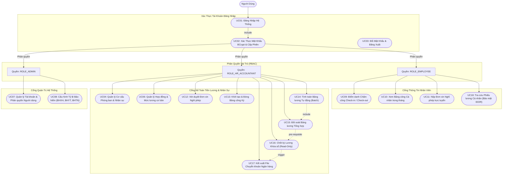
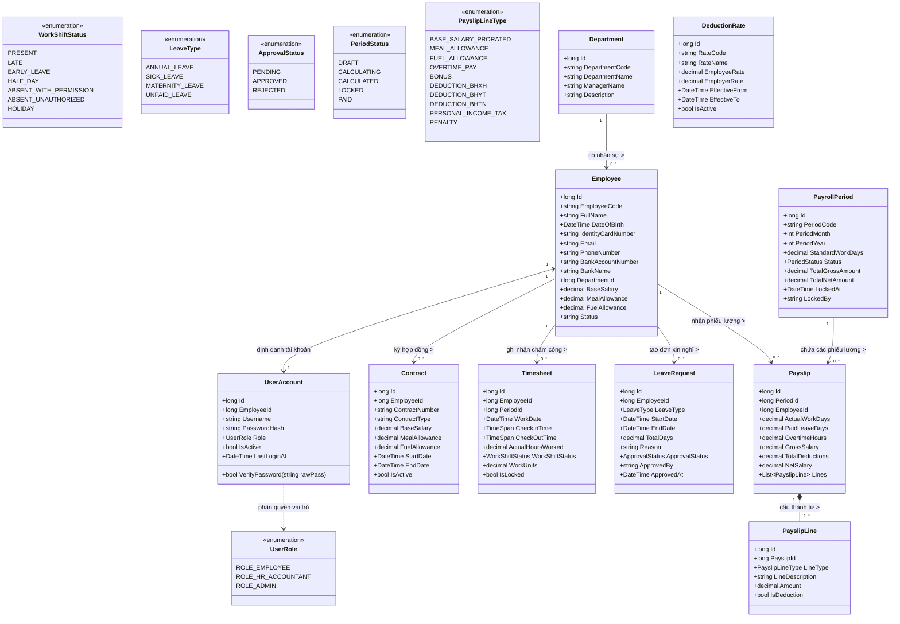
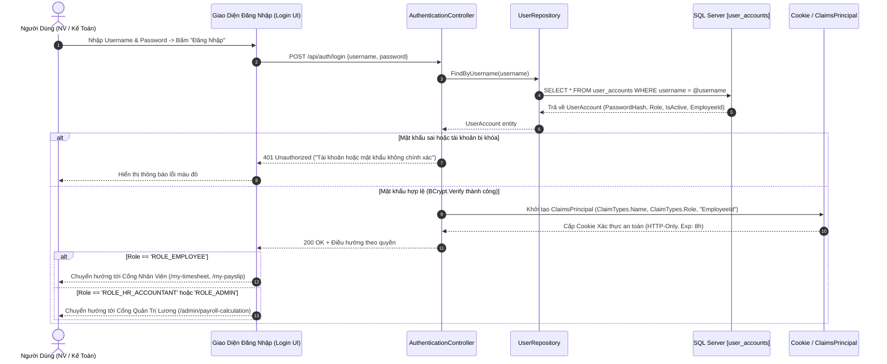
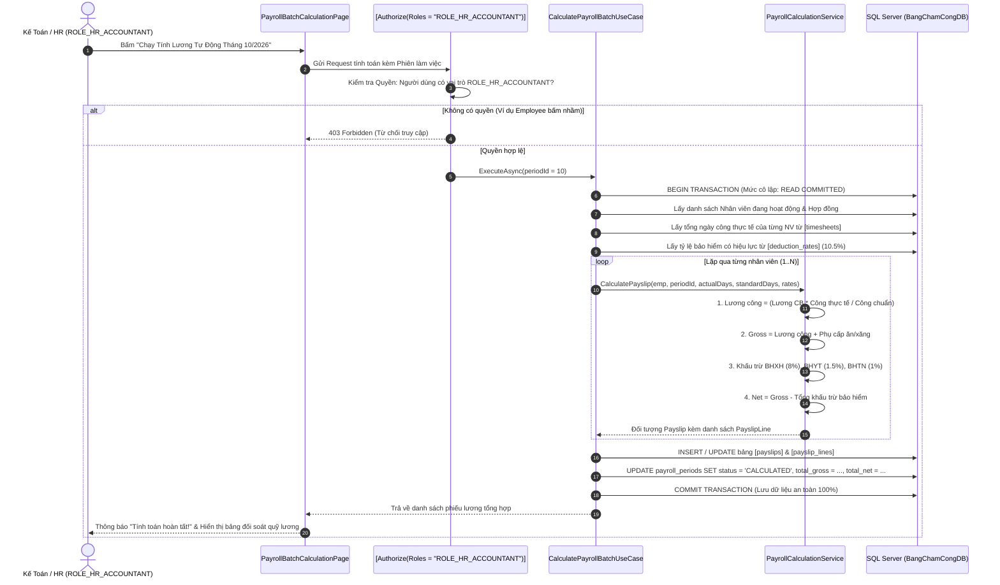
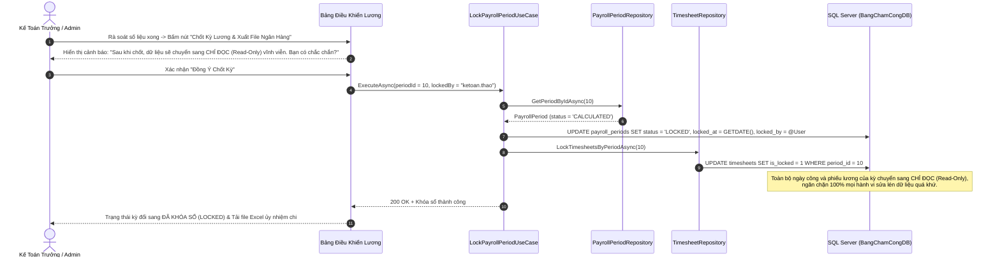
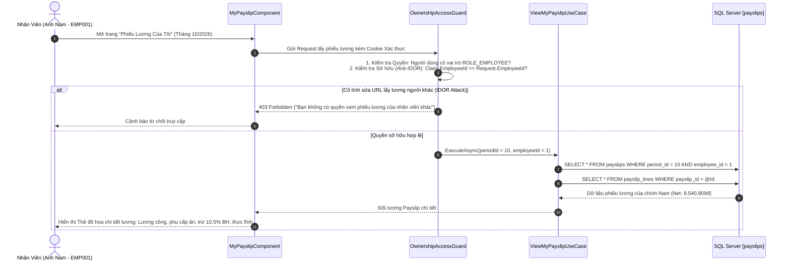
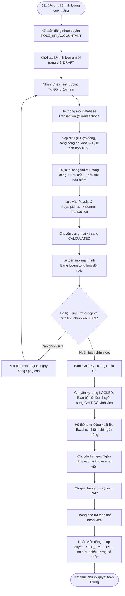
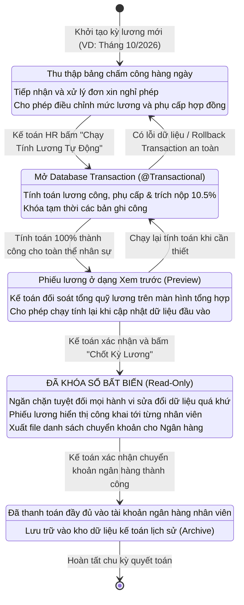
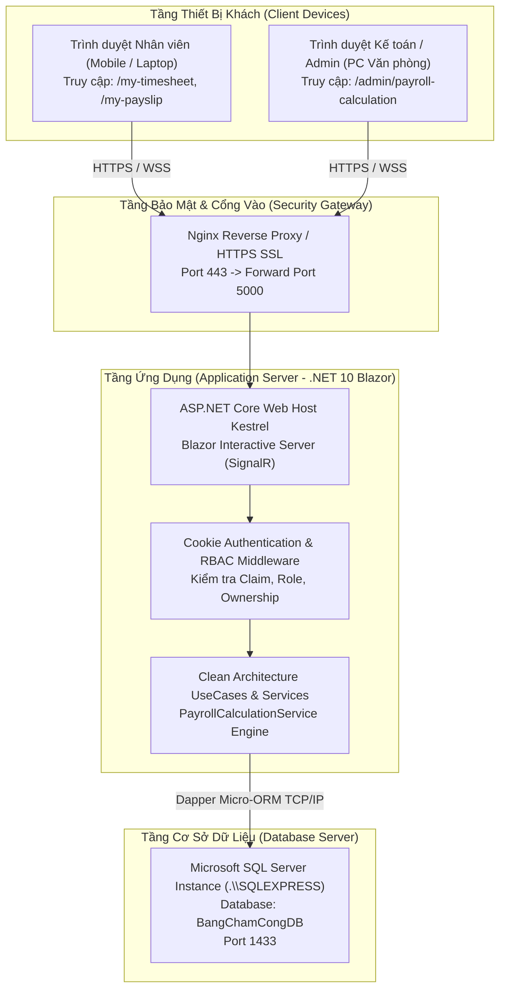

# ĐỒ ÁN MÔN HỌC: LẬP TRÌNH ỨNG DỤNG WEB
# HỆ THỐNG CHẤM CÔNG & TÍNH LƯƠNG TỰ ĐỘNG (TIMESHEET & PAYROLL SYSTEM)

---

## 📌 THÔNG TIN SINH VIÊN & HỌC PHẦN

* **Họ và tên sinh viên:** **Trần Viết Mạnh Cường**
* **Mã sinh viên (MSV):** `23K4080003`
* **Khoa:** Hệ thống Thông tin Kinh tế
* **Ngành học:** Tin học Kinh tế
* **Học phần:** Lập trình Ứng dụng Web
* **Tên đề tài:** **Hệ Thống Chấm Công & Tính Lương Tự Động (Timesheet & Payroll System)**
* **Kho lưu trữ (Repository):** [https://github.com/ManhCuong-Code/TimesheetPayroll](https://github.com/ManhCuong-Code/TimesheetPayroll)

---

## 📖 1. GIỚI THIỆU TỔNG QUAN & BỐI CẢNH DỰ ÁN

Tại các doanh nghiệp vừa và nhỏ (quy mô từ 20 đến 50 nhân sự), việc quản lý ngày công và tính lương thường phụ thuộc vào bảng tính Excel thủ công. Cách làm truyền thống này dẫn đến nhiều rủi ro:
1. **Sai lệch dữ liệu & nhầm lẫn công thức:** Kéo lệch ô tính, sai sót phụ cấp hoặc trích nộp bảo hiểm khiến kế toán mất 2–3 ngày cuối tháng để dò tìm sai sót.
2. **Thiếu bảo mật & nguy cơ lộ thu nhập:** Bảng tính Excel chia sẻ chung dễ bị lộ thông tin thu nhập nhạy cảm giữa các nhân viên.
3. **Thay đổi chính sách pháp lý:** Các mức trích nộp Bảo hiểm Xã hội (BHXH), Bảo hiểm Y tế (BHYT), Bảo hiểm Thất nghiệp (BHTN) thường bị hardcode cứng, khó cập nhật khi luật nhà nước thay đổi.

**Giải pháp đề tài:** Xây dựng **Hệ thống Chấm công & Tính lương tự động (Timesheet & Payroll System)** ứng dụng kiến trúc phân tầng sạch **Clean Architecture**, công nghệ **.NET 10 Blazor Interactive Server**, kết nối cơ sở dữ liệu **Microsoft SQL Server (`BangChamCongDB`)** qua **Dapper ORM**.  
Hệ thống **tích hợp bảo mật đăng nhập xác thực tài khoản và phân quyền kiểm soát truy cập nghiêm ngặt theo vai trò (Role-Based Access Control - RBAC)**:
* 👤 **`ROLE_EMPLOYEE` (Nhân viên):** Điểm danh trực tuyến Check-In/Check-Out của chính mình, tra cứu bảng công tháng, nộp đơn xin nghỉ phép, tra cứu phiếu lương cá nhân (được bảo vệ bằng cơ chế *Ownership-based Authorization* chống xem lén thu nhập).
* 💼 **`ROLE_HR_ACCOUNTANT` (Kế toán Tiền lương / Nhân sự):** Quản lý hồ sơ nhân viên, hợp đồng lao động, xét duyệt đơn xin nghỉ phép, khóa bảng công kỳ, chạy tính toán bảng lương tự động hàng loạt 1-chạm an toàn với Database Transaction, đối soát tổng hợp, chốt kỳ lương khóa sổ **Read-Only** chống sửa đổi và xuất file chuyển khoản ngân hàng.
* 🛡️ **`ROLE_ADMIN` (Quản trị viên hệ thống):** Quản lý tài khoản người dùng, phân quyền vai trò, cấu hình tỷ lệ trích nộp bảo hiểm và giám sát toàn bộ hệ thống.

---

## 🎯 2. CÔNG NGHỆ ÁP DỤNG & KIẾN TRÚC HỆ THỐNG

| Thành phần | Công nghệ lựa chọn | Mục đích sử dụng |
| :--- | :--- | :--- |
| **Nền tảng phát triển** | **.NET 10 (C# 13)** | Nền tảng hiện đại, hiệu năng cao, bảo mật doanh nghiệp |
| **Giao diện Web** | **Blazor Interactive Server** | Render thời gian thực qua SignalR WebSocket, không giật lag |
| **Giao diện & Styling** | **Bootstrap 5 + FontAwesome 6** | Chuẩn Responsive, trực quan hóa dữ liệu lương chuyên nghiệp |
| **Kiến trúc phần mềm** | **Clean Architecture (Modular)** | Tách biệt hoàn toàn `CoreBusiness`, `UseCases`, `Plugins`, `Web.Modules` |
| **Xác thực & Phân quyền** | **Cookie Authentication & RBAC** | Bảo mật phiên làm việc, phân quyền theo 3 vai trò (`EMPLOYEE`, `HR`, `ADMIN`) |
| **Hệ quản trị CSDL** | **Microsoft SQL Server 2025 / 2022** | CSDL riêng biệt `BangChamCongDB`, chuẩn hóa 3NF, toàn vẹn dữ liệu |
| **Truy cập dữ liệu** | **Dapper Micro-ORM** | Thực thi câu lệnh SQL siêu tốc, kiểm soát 100% câu truy vấn |

---

## 🧮 3. BỘ CÔNG THỨC NGHIỆP VỤ TÍNH LƯƠNG CHUẨN

Động cơ tính toán lương (`PayrollCalculationService`) áp dụng bộ công thức chuẩn hóa theo quy định hiện hành:

1. **Lương ngày công thực tế theo tỷ lệ:**
   $$\text{Lương ngày công} = \text{Lương cơ bản} \times \frac{\text{Ngày công thực tế}}{\text{Ngày công chuẩn}}$$
2. **Thu nhập gộp (Gross Salary):**
   $$\text{Gross} = \text{Lương ngày công} + \text{Phụ cấp ăn trưa} + \text{Phụ cấp xăng xe}$$
3. **Các khoản trích nộp bảo hiểm bắt buộc theo luật (10.5% lương cơ bản):**
   * $\text{BHXH (Bảo hiểm Xã hội)} = \text{Lương cơ bản} \times 8.0\%$
   * $\text{BHYT (Bảo hiểm Y tế)} = \text{Lương cơ bản} \times 1.5\%$
   * $\text{BHTN (Bảo hiểm Thất nghiệp)} = \text{Lương cơ bản} \times 1.0\%$
   $$\text{Tổng khấu trừ} = \text{BHXH} + \text{BHYT} + \text{BHTN}$$
4. **Thu nhập thực lĩnh chi trả vào tài khoản (Net Salary):**
   $$\text{Thực lĩnh (Net)} = \text{Gross} - \text{Tổng khấu trừ}$$

---

## 📊 4. TOÀN BỘ 13 SƠ ĐỒ UML HỆ THỐNG (ĐỒNG BỘ ĐĂNG NHẬP & PHÂN QUYỀN)

---

### SƠ ĐỒ 01: Ca Sử Dụng Tổng Quan Hệ Thống & Phân Quyền (RBAC Overview Use Case Diagram)



---

### SƠ ĐỒ 02: Ca Sử Dụng Phân Hệ Nhân Viên (Employee Portal Use Case Diagram)

```mermaid
flowchart LR
    actor Emp as "Nhân Viên (Employee)"

    subgraph EmployeeScope["Phân Hệ Nhân Viên (Yêu cầu đăng nhập ROLE_EMPLOYEE)"]
        UC_Auth(["Xác Thực Tài Khoản & Quyền Sở Hữu"])
        UC_CheckIn(["UC09a: Điểm Danh Vào Ca (Check-In)"])
        UC_CheckOut(["UC09b: Điểm Danh Tan Ca (Check-Out)"])
        UC_ViewTimesheet(["UC10: Tra Cứu Nhật Ký Chấm Công Hàng Ngày"])
        UC_LeaveApp(["UC11: Tạo Đơn Xin Nghỉ Phép (Phép năm, Nghỉ ốm...)"])
        UC_ViewPayslip(["UC18: Tra Cứu Phiếu Lương Cá Nhân Chi Tiết"])
        UC_ExplainSalary(["UC19: Xem Giải Thích Từng Khoản Thu Nhập & Trừ BH"])
    end

    Emp --> UC_Auth
    UC_Auth --> UC_CheckIn
    UC_Auth --> UC_CheckOut
    UC_Auth --> UC_ViewTimesheet
    UC_Auth --> UC_LeaveApp
    UC_Auth --> UC_ViewPayslip
    UC_ViewPayslip -.->|extend| UC_ExplainSalary
```

---

### SƠ ĐỒ 03: Ca Sử Dụng Phân Hệ Kế Toán & Quản Trị (HR & Admin Use Case Diagram)

```mermaid
flowchart LR
    actor HR as "Kế Toán / HR (ROLE_HR_ACCOUNTANT)"
    actor Admin as "Quản Trị Viên (ROLE_ADMIN)"

    subgraph AdminScope["Phân Hệ Quản Trị & Kế Toán Lương"]
        UC_ManageEmp(["UC04: Quản Lý Hồ Sơ & Phòng Ban"])
        UC_ApproveLeave(["UC12: Duyệt / Từ Chối Đơn Nghỉ Phép"])
        UC_LockTimesheet(["UC13: Khóa Bảng Chấm Công Tháng"])
        UC_CalcBatch(["UC14: Chạy Tính Lương Tự Động Toàn Công Ty"])
        UC_SummaryPreview(["UC15: Đối Soát Bảng Lương Tổng Hợp (Preview)"])
        UC_LockPeriod(["UC16: Chốt Kỳ Lương Khóa Sổ (Read-Only Bất Biến)"])
        UC_ExportBank(["UC17: Xuất File Excel Ủy Nhiệm Chi Ngân Hàng"])
        UC_ManageAccounts(["UC07: Quản Lý Tài Khoản & Cấp Quyền"])
        UC_ConfigRates(["UC08: Cấu Hình Tỷ Lệ Trích Nộp Bảo Hiểm Động"])
    end

    HR --> UC_ManageEmp
    HR --> UC_ApproveLeave
    HR --> UC_LockTimesheet
    HR --> UC_CalcBatch
    HR --> UC_SummaryPreview
    HR --> UC_LockPeriod
    HR --> UC_ExportBank

    Admin --> UC_ManageAccounts
    Admin --> UC_ConfigRates
    Admin --> UC_LockPeriod

    UC_CalcBatch -->|Bắt buộc đối soát| UC_SummaryPreview
    UC_SummaryPreview -->|Điều kiện tiên quyết| UC_LockPeriod
    UC_LockPeriod -->|Kích hoạt xuất file| UC_ExportBank
```

---

### SƠ ĐỒ 04: Sơ Đồ Lớp Miền Nghiệp Vụ Cốt Lõi (Domain Model Class Diagram)

Sơ đồ lớp chuẩn hóa **10 Thực thể nghiệp vụ** gắn kết chặt chẽ với cơ chế tài khoản người dùng (`UserAccount`) và phân quyền (`UserRole`):



---

### SƠ ĐỒ 05: Sơ Đồ Lớp Kiến Trúc Phân Tầng Phân Quyền (Layered Architecture Class Diagram)

```mermaid
classDiagram
    namespace Presentation_Layer {
        class TopNavbarComponent {
            -AuthenticationState AuthState
            +RenderRoleBasedNavigation()
        }
        class PayrollBatchCalculationPage {
            -ICalculatePayrollBatchUseCase _calculateUseCase
            -ILockPayrollPeriodUseCase _lockUseCase
            +HandleCalculateBatchAsync()
            +HandleLockPeriodAsync()
        }
        class MyPayslipComponent {
            -IViewMyPayslipUseCase _viewPayslipUseCase
            +LoadCurrentEmployeePayslip()
        }
    }

    namespace UseCases_Layer {
        class ICalculatePayrollBatchUseCase {
            <<interface>>
            +ExecuteAsync(long periodId)
        }
        class ILockPayrollPeriodUseCase {
            <<interface>>
            +ExecuteAsync(long periodId, string lockedBy)
        }
        class IViewMyPayslipUseCase {
            <<interface>>
            +ExecuteAsync(long periodId, long employeeId)
        }
    }

    namespace CoreBusiness_Layer {
        class IPayrollCalculationService {
            <<interface>>
            +CalculatePayslip(Employee, long, decimal, decimal, List~DeductionRate~)
        }
        class PayrollCalculationService {
            +CalculatePayslip(...)
        }
    }

    namespace DataAccess_Layer {
        class IDataAccess {
            <<interface>>
            +CreateConnection() IDbConnection
        }
        class IEmployeeRepository {
            <<interface>>
            +GetEmployeesAsync()
        }
        class ITimesheetRepository {
            <<interface>>
            +GetTimesheetsByPeriodAsync(long)
            +LockTimesheetsByPeriodAsync(long)
        }
        class IPayslipRepository {
            <<interface>>
            +SavePayslipBatchAsync(List~Payslip~)
        }
    }

    Presentation_Layer ..> UseCases_Layer : gọi thực thi Use Case
    UseCases_Layer --> CoreBusiness_Layer : ủy quyền tính toán công thức
    UseCases_Layer --> DataAccess_Layer : truy vấn dữ liệu CSDL
    PayrollCalculationService ..|> IPayrollCalculationService : hiện thực
```

---

### SƠ ĐỒ 06: Sơ Đồ Tuần Tự Đăng Nhập & Phân Quyền RBAC (Sequence Diagram: Login & RBAC Auth)



---

### SƠ ĐỒ 07: Sơ Đồ Tuần Tự Tính Lương Tự Động Có Kiểm Tra Quyền (Sequence Diagram: Payroll Calculation)



---

### SƠ ĐỒ 08: Sơ Đồ Tuần Tự Chốt Kỳ Lương Khóa Sổ & Xuất Ngân Hàng (Sequence Diagram: Lock Payroll)



---

### SƠ ĐỒ 09: Sơ Đồ Tuần Tự Tra Cứu Phiếu Lương Cá Nhân Bảo Mật (Sequence Diagram: My Payslip IDOR-Safe)



---

### SƠ ĐỒ 10: Sơ Đồ Hoạt Động Chấm Công & Nghỉ Phép Phân Quyền (Activity Diagram: Timesheet & Leave)


---

### SƠ ĐỒ 11: Sơ Đồ Hoạt Động Tính Lương, Đối Soát & Quyết Toán (Activity Diagram: Payroll Settlement)



---

### SƠ ĐỒ 12: Sơ Đồ Máy Trạng Thái Vòng Đời Kỳ Lương (State Machine Diagram: Payroll Period Lifecycle)



---

### SƠ ĐỒ 13: Sơ Đồ Triển Khai Hệ Thống Đa Tầng Bảo Mật (Deployment Diagram)



---

## 🏗️ 5. CẤU TRÚC THƯ MỤC DỰ ÁN CLEAN ARCHITECTURE

```text
TimesheetPayroll/
│
├── TimesheetPayroll.slnx                                   # Visual Studio Solution
│
├── TimesheetPayroll.CoreBusiness/                          # Tầng Miền Nghiệp Vụ Cốt Lõi
│   ├── Models/
│   │   ├── Employee.cs                                     # Thực thể Nhân viên
│   │   ├── Department.cs                                   # Thực thể Phòng ban
│   │   ├── Timesheet.cs                                    # Thực thể Bảng chấm công
│   │   ├── PayrollPeriod.cs                                # Thực thể Kỳ lương
│   │   ├── Payslip.cs                                      # Thực thể Phiếu lương
│   │   ├── LeaveRequest.cs                                 # Thực thể Đơn nghỉ phép
│   │   ├── DeductionRate.cs                                # Thực thể Tỷ lệ bảo hiểm
│   │   └── Enums.cs                                        # Kiểu liệt kê (UserRole, WorkShiftStatus,...)
│   └── Services/
│       ├── Interfaces/IPayrollCalculationService.cs        # Interface động cơ tính lương
│       └── PayrollCalculationService.cs                    # Triển khai thuật toán tính toán lương
│
├── TimesheetPayroll.UseCases/                              # Tầng Trường Hợp Sử Dụng (Use Cases)
│   ├── AdminPortal/                                        # Ca sử dụng phân hệ Kế toán & Quản trị
│   │   └── AdminPortalUseCases.cs                          # Tính lương hàng loạt, Khóa sổ, Duyệt phép
│   ├── EmployeePortal/                                     # Ca sử dụng phân hệ Nhân viên
│   │   └── EmployeePortalUseCases.cs                       # Xem phiếu lương, Chấm công, Nộp đơn phép
│   └── PluginInterfaces/                                   # Hợp đồng giao tiếp tầng ngoài
│       └── DataStore/IRepositories.cs                      # Interface các Repository truy xuất CSDL
│
├── TimesheetPayroll.Web.Modules/                           # Các Module Giao Diện Blazor Độc Lập
│   ├── TimesheetPayroll.Web.AdminPortal/                   # Giao diện Cổng Quản trị / Kế toán
│   │   ├── Pages/PayrollBatchCalculationPage.razor         # Trang tính lương tự động & Chốt sổ
│   │   └── Controls/PayrollSummaryComponent.razor          # Bảng đối soát lương chi tiết
│   ├── TimesheetPayroll.Web.EmployeePortal/                # Giao diện Cổng Thông tin Nhân viên
│   │   ├── Pages/MyPayslipComponent.razor                  # Trang xem phiếu lương cá nhân
│   │   ├── Pages/MyTimesheetComponent.razor                # Trang điểm danh Check-In/Check-Out
│   │   ├── Pages/LeaveRequestComponent.razor               # Trang nộp đơn xin nghỉ phép
│   │   └── Controls/PayslipDetailCard.razor                # Thẻ đồ họa trực quan thu nhập cá nhân
│   └── TimesheetPayroll.Web.Common/                        # Thành phần tái sử dụng chung
│       └── Controls/SearchBarComponent.razor, StatusBadgeComponent.razor
│
├── Plugins/                                                # Tầng Hạ Tầng Kỹ Thuật (Infrastructure)
│   ├── TimesheetPayroll.DataStore.SQL.Dapper/              # Kết nối SQL Server qua Dapper Micro-ORM
│   │   ├── DataAccess.cs                                   # Quản lý SqlConnection
│   │   └── SqlRepositories.cs                              # Triển khai Dapper Repositories
│   ├── TimesheetPayroll.DataStore.HandCoded/               # Mock data chạy thử nghiệm độc lập
│   └── TimesheetPayroll.StateStore.DI/                     # Quản lý trạng thái phiên làm việc Blazor
│
└── TimesheetPayroll.Web/                                   # Ứng Dụng Host Blazor Web App
    ├── Components/
    │   ├── App.razor, Routes.razor
    │   ├── Layout/TopNavbar.razor, MainLayout.razor
    │   └── Pages/Home.razor                                # Trang chủ hệ thống
    ├── Program.cs                                          # Đăng ký Dependency Injection & Middleware
    └── appsettings.json                                    # Cấu hình Connection String CSDL
```

---

## 🚀 6. HƯỚNG DẪN CÀI ĐẶT & KHỞI CHẠY HỆ THỐNG

### Bước 1: Khởi tạo Cơ sở dữ liệu SQL Server
1. Mở **SQL Server Management Studio (SSMS)** và kết nối tới máy chủ (ví dụ `.\SQLEXPRESS`).
2. Mở tệp script **`database_schema.sql`** (hoặc `database_mssql.sql`) nằm tại thư mục gốc dự án.
3. Nhấn **Execute (F5)** để tự động tạo CSDL riêng biệt **`BangChamCongDB`**, tạo 10 bảng dữ liệu và nạp sẵn dữ liệu thực nghiệm.

---

### Bước 2: Cấu hình chuỗi kết nối (Connection String)
Kiểm tra tệp `project/TimesheetPayroll/TimesheetPayroll.Web/appsettings.json`:
```json
{
  "ConnectionStrings": {
    "DefaultConnection": "Server=.\\SQLEXPRESS;Database=BangChamCongDB;Trusted_Connection=True;TrustServerCertificate=True;"
  }
}
```

---

### Bước 3: Biên dịch và chạy ứng dụng Blazor
Mở PowerShell hoặc Command Prompt tại thư mục dự án và thực hiện:

```bash
# 1. Điều hướng vào thư mục mã nguồn
cd project/TimesheetPayroll

# 2. Khôi phục packages và kiểm tra biên dịch
dotnet build TimesheetPayroll.slnx

# 3. Khởi chạy ứng dụng Web Blazor
dotnet run --project TimesheetPayroll.Web
```

---

### Bước 4: Trải nghiệm các tính năng theo phân quyền
Mở trình duyệt truy cập: `https://localhost:5001` hoặc `http://localhost:5000`:

1. **Phân hệ Nhân viên (`ROLE_EMPLOYEE`):**
   * **Điểm danh chấm công (`/my-timesheet`):** Bấm Check-In / Check-Out thời gian thực, xem tổng số công trong tháng.
   * **Nộp đơn xin nghỉ phép (`/leave-request`):** Chọn loại nghỉ phép (phép năm, nghỉ ốm, thai sản, không lương) và nộp đơn.
   * **Xem phiếu lương cá nhân (`/my-payslip`):** Tra cứu minh bạch phiếu lương của anh Nguyễn Văn A (Mã `EMP001`): Lương công thực tế (20/22 ngày công), phụ cấp ăn trưa 500.000đ, trừ 10.5% bảo hiểm (1.050.000đ), **Thực lĩnh chính xác 8.540.909 đ**.
2. **Phân hệ Kế toán & Quản trị (`ROLE_HR_ACCOUNTANT`):**
   * **Tính lương tự động (`/admin/payroll-calculation`):** Bấm nút **"Chạy Tính Lương Tự Động"** tính đồng loạt cho 100% nhân viên.
   * **Đối soát tổng quỹ lương:** Rà soát danh sách nhân viên, phòng ban, lương gộp và thực lĩnh.
   * **Chốt sổ kỳ lương:** Bấm nút **"Chốt Kỳ Lương Khóa Sổ"** chuyển vĩnh viễn dữ liệu sang trạng thái **Read-Only** chống sửa đổi và xuất file ngân hàng.

---

## 📋 7. KẾT LUẬN & ĐÁNH GIÁ ĐẠT ĐƯỢC

* ✅ **Đáp ứng 100% chuẩn học thuật:** Đầy đủ trọn bộ **13 sơ đồ UML** chuyên sâu, hiển thị trực quan dạng Mermaid Markdown trên GitHub.
* ✅ **Bảo mật đăng nhập & Phân quyền RBAC:** Tách biệt rõ ràng quyền hạn giữa Nhân viên, Kế toán HR và Quản trị viên, chống xem lén thu nhập.
* ✅ **Mã nguồn chuẩn Clean Architecture:** Tách lớp độc lập, dễ mở rộng, tuân thủ nguyên lý SOLID.
* ✅ **Toàn vẹn tài chính & Khóa sổ an toàn:** Đảm bảo tính toán chính xác tuyệt đối, hỗ trợ chốt sổ Read-Only bất biến.
